## Boardgame SpringBoot Application on Kubernetes with Monitoring and Security

This project provides a streamlined approach to deploy your SpringBoot boardgame application on a Kubernetes cluster hosted on AWS while ensuring comprehensive monitoring and security. The deployment process is automated using a GitHub Actions CICD pipeline.

## Overview


- **Backend**: SpringBoot application for your boardgame.
- **Cloud Provider**: Amazon Web Services.
- **Containerization**: Docker for building container images.
- **Code Quality Check**: SonarQube for code quality check.
- **Orchestration**: Kubernetes for managing container deployments and scaling.
- **Self-Hosted Runner**: Dedicated EC2 instance for running GitHub Actions workflows
#### Monitoring
- **Prometheus**: Collects and stores application and system metrics.
- **Grafana**: Visualizes collected metrics for insights.
- **Node Exporter**: Exposes system stats as Prometheus metrics.
- **Blackbox Exporter**: Monitors external services.
#### **Security**
- **Trivy**: Scans container images for vulnerabilities.
- **CI/CD**: GitHub Actions workflow automates build, image push, and deployment.

## Features

- Automated build and deployment process through GitHub Actions
- Containerized application for portability and scalability
- Real-time monitoring of application and system health
- Customizable dashboards for visualizing key metrics
- vulnerability scanning of container images with Trivy
## Prerequisites

- Java 11+
- AWS Account with IAM user access
- kubectl configured to interact with your Kubernetes cluster
- Git installed
- Docker installed 

## Setting Up the Project

### Clone the Repository:

```Bash
git clone https://github.com/ARUP-G/CICD-Pipeline-Using-GitHub-Actions.git
```

### Configure AWS :
We are creating 2 Ec2 instances for kubernetes Master and Kubernetes Worker and another Ec2 instance for Github Actions Self-Hosted Runner.
To create an Ubuntu EC2 instance in AWS, follow these steps:

1. **Sign in to the AWS Management Console**:
   - Go to the AWS Management Console at https://aws.amazon.com/console/.
   - Sign in with your AWS account credentials.

2. **Navigate to EC2**:
   - Once logged in, navigate to the EC2 dashboard by typing "EC2" in the search bar at the top or by selecting "Services" and then "EC2" under the "Compute" section.

3. **Launch Instance**:
   - Click on the "Instances" link in the EC2 dashboard sidebar.
   - Click the "Launch Instance" button.

4. **Choose an Amazon Machine Image (AMI)**:
   - In the "Step 1: Choose an Amazon Machine Image (AMI)" section, select "Ubuntu" from the list of available AMIs.
   - Choose the Ubuntu version you want to use. For example, "Ubuntu Server 20.04 LTS".
   - Click "Select".

5. **Choose an Instance Type**:
   - In the "Step 2: Choose an Instance Type" section, select the instance type that fits your requirements. The default option (usually a t2.micro instance) is suitable for testing and small workloads.
   - Click "Next: Configure Instance Details".
   ```
   Note: Try to select instance type which has 2 or more Cpu to omit any error on K8s side.
   ```

6. **Configure Instance Details**:
   - Optionally, configure instance details such as network settings, subnets, IAM role, etc. You can leave these settings as default for now.
   - Click "Next: Add Storage".

7. **Add Storage**:
   - Specify the size of the root volume (default is usually fine for testing purposes).
   - Click "Next: Add Tags".

8. **Add Tags**:
   - Optionally, add tags to your instance for better organization and management.
   - Click "Next: Configure Security Group".

9. **Configure Security Group**:
   - In the "Step 6: Configure Security Group" section, configure the security group to allow SSH access (port 22) from your IP address.
   - You may also want to allow other ports based on your requirements (e.g., HTTP, HTTPS) as in this pic 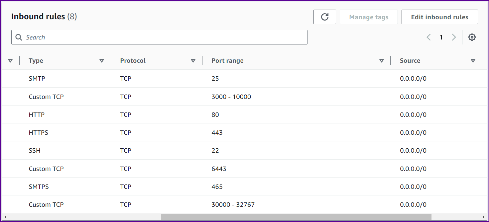
   - Click "Review and Launch".

10. **Review and Launch**:
    - Review the configuration of your instance.
    - Click "Launch".

11. **Select Key Pair**:
    - In the pop-up window, select an existing key pair or create a new one.
    - Check the acknowledgment box.
    - Click "Launch Instances".

12. **Access Your Instance**:
    - Use Mobaxterm 


### Configure Kubernetes Cluster:
1. Update System Packages [On Master & Worker Node]

    ```bash
    sudo apt-get update
    ```

2. **Install Docker [On Master & Worker Node]**

    ```bash
    sudo apt install docker.io -y
    sudo chmod 666 /var/run/docker.sock
    ```

3. **Install Required Dependencies for Kubernetes [On Master & Worker Node]**

    ```bash
    sudo apt-get install -y apt-transport-https ca-certificates curl gnupg
    sudo mkdir -p -m 755 /etc/apt/keyrings
    ```

4. **Add Kubernetes Repository and GPG Key [On Master & Worker Node]**

    ```bash
    curl -fsSL https://pkgs.k8s.io/core:/stable:/v1.28/deb/Release.key | sudo gpg --dearmor -o /etc/apt/keyrings/kubernetes-apt-keyring.gpg
    echo 'deb [signed-by=/etc/apt/keyrings/kubernetes-apt-keyring.gpg] https://pkgs.k8s.io/core:/stable:/v1.28/deb/ /' | sudo tee /etc/apt/sources.list.d/kubernetes.list
    ```

5. **Update Package List [On Master & Worker Node]**

    ```bash
    sudo apt update
    ```

6. **Install Kubernetes Components [On Master & Worker Node]**

    ```bash
    sudo apt install -y kubeadm=1.28.1-1.1 kubelet=1.28.1-1.1 kubectl=1.28.1-1.1
    ```

7. **Initialize Kubernetes Master Node [On MasterNode]**

    ```bash
    sudo kubeadm init --pod-network-cidr=10.244.0.0/16
    ```

8. **Configure Kubernetes Cluster [On MasterNode]**

    ```bash
    mkdir -p $HOME/.kube
    sudo cp -i /etc/kubernetes/admin.conf $HOME/.kube/config
    sudo chown $(id -u):$(id -g) $HOME/.kube/config
    ```

9. **Deploy Networking Solution (Calico) [On MasterNode]**
    ```bash
    kubectl apply -f https://docs.projectcalico.org/manifests/calico.yaml
    ```

10. **Deploy Ingress Controller (NGINX) [On MasterNode]**

    ```bash
    kubectl apply -f https://raw.githubusercontent.com/kubernetes/ingress-nginx/controller-v0.49.0/deploy/static/provider/baremetal/deploy.yaml
    ```
11. **Connect Master Node with Worker Node [On Worker]** 

    Run Join Command on Worker Node:
    
    ```bash
    sudo kubeadm join <master-node-ip>:<master-node-port> --token <token> --discovery-token-ca-cert-hash <hash>
    ```
12. **Ckeck Kubernetes nodes [On Master]**
    ```bash
    kubectl get nodes
    ```
    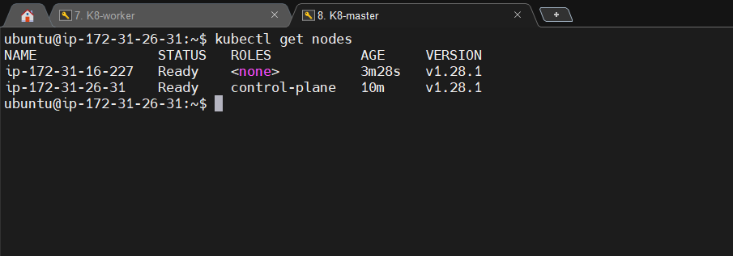

13. **Create a namespace on Kubernetes**
    ```bash
    kubectl create namespace production
    ```
14. **Create Role Based Service Account**

    Create a `svc.yml` file in ec2, copy the file content from K8s-setup directory from the repository and execute
    ```bash
    kubectl apply -f scv.yml
    ```
15. **Create Role for Service Account**

    Create a `role.yml` file in ec2, copy the file content from K8s-setup directory from the repository and execute
    ```bash
    kubectl apply -f role.yml
    ```
16. **Create Role Bind for Service Account**

    Create a `bind.yml` file in ec2, copy the file content from K8s-setup directory from the repository and execute
    ```bash
    kubectl apply -f bind.yml
    ```
14. **Create Secret for authentication of K8s Cluster**

    Create a `secret.yml` file in ec2, copy the file content from K8s-setup directory from the repository and execute
    ```bash
    kubectl apply -f secret.yml -n production
    ```
15. **Add Secret to access K8s Cluster**
    Go to `./kube` directory and convert `config` file to base64 format
    ```bash
    cd ./kube
    base64 ./kube/config
    ```
    copy the output and set it in Step-6 of `Repository Secrets` and save as `Kube_config`
### Configure Runner server:

1. **Update System Packages** 

    ```bash
    sudo apt-get update
    ```

2. **Install Docker**

    ```bash
    sudo apt install docker.io -y
    sudo chmod 666 /var/run/docker.sock
    ``` 
3.  **Run the following command [SonarQube]**:

    ```bash
    docker run -d --name sonar -p 9000:9000 sonarqube:lts-community
    ```

    This command will download the `sonarqube:lts-community` Docker image from Docker Hub if it's not already available locally. Then, it will create a container named "sonar" from this image, running it in detached mode (`-d` flag) and mapping port 9000 on the host machine to port 9000 in the container (`-p 9000:9000` flag).

4. **Access SonarQube by opening a web browser**.

    Navigating to `http://runner-ec2-public-ip:9000`
    This will start the SonarQube server, and you should be able to access it using the provided URL.
    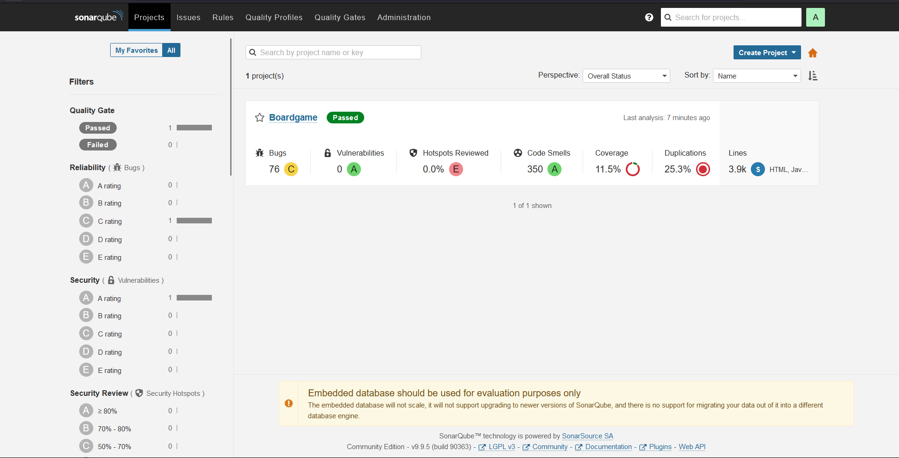

5. **Setup Trivy for vulnerablity scan**
    ```bash
    sudo apt-get install wget apt-transport-https gnupg lsb-release
    wget -qO - https://aquasecurity.github.io/trivy-repo/deb/public.key | sudo apt-key add -
    echo deb https://aquasecurity.github.io/trivy-repo/deb $(lsb_release -sc) main | sudo tee -a /etc/apt/sources.list.d/trivy.list
    sudo apt-get update
    sudo apt-get install trivy
    ```

### Configure GitHub Actions:

1. **Go to setting page of the repo**

2. **Click action -> Runners -> Create New-Self-Hosted-Runner**

3. **Follow the configaration steps**
    

4. **Execute `run.sh` file in `actions-runner` directory**

5. **Check Runners page on GitHub to ckeck the Runner status**
    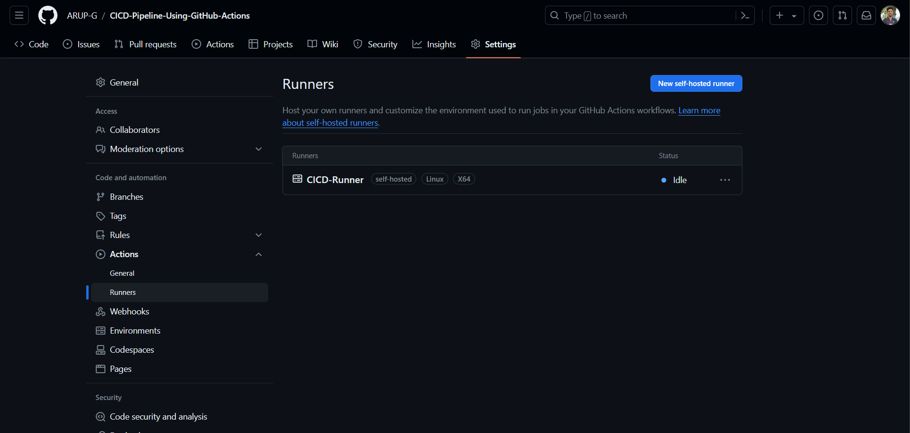

6. **Create Repository Secrets for CI/CD Pipeline**.

    Go to repo settings -> Secrets and Variables -> Actions -> New Repository Secret 
    make sure to keep the same secret names as below
    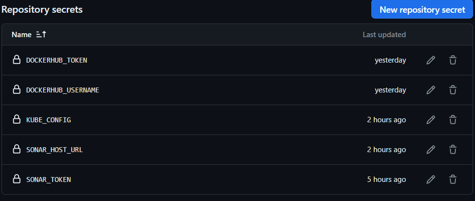

7. **Run the CICD-Pipeline on GitHUb actions**
    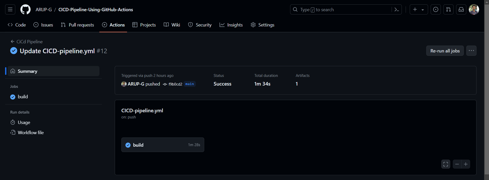

8. **Port on which application is deployed**

    Go to Build summary and find the Kubernetes stage and find the svc port.
    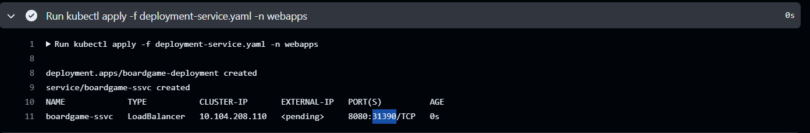

9. **Access the application**

    access the application on ``http://runner-ec2-public-ip:k8ssvc-portnumber``
    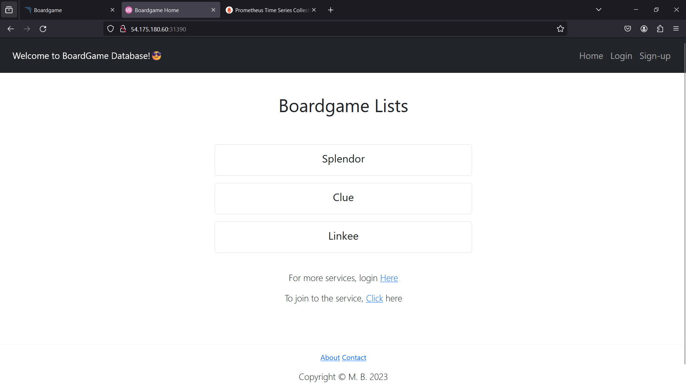

## Setup Monitoring
### Configure Prometheus:

1. **Download Prometheus**

    Go to `https://prometheus.io/download/` and get prometheus linux version.
    ```bash
    wget https://github.com/prometheus/prometheus/releases/download/v2.45.5/prometheus-2.45.5.linux-amd64.tar.gz
    ```
2. **Unzip Prometheus**

    ```bash
    tar -xvf prometheus-2.45.5.linux-amd64.tar.gz
    ```
3. **Run Prometheus**

    ```bash
    cd prometheus-2.45.5.linux-amd64
    # Run on background
    ./prometheus &
    ```
4. **Access prometheus**

    Visit `http://runner-ec2-public-ip:9090` and go to `Status` then `Targets`
    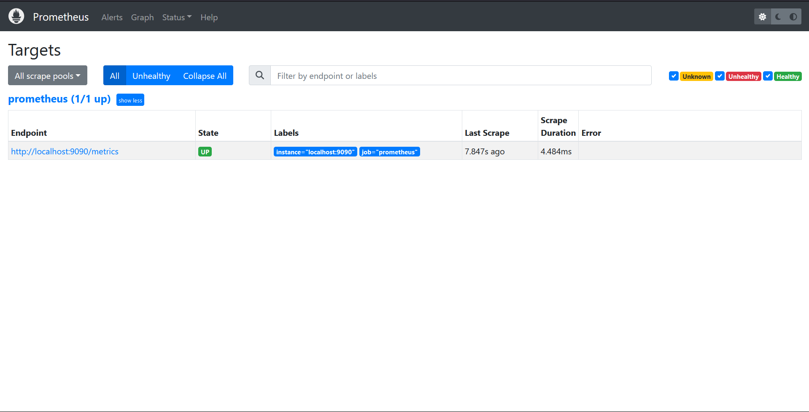

5. **Add BlackBox For External Service monitoting**

    Go to `https://prometheus.io/download/` and get Blackbox_exporter linux version.
    ```bash
    wget https://github.com/prometheus/blackbox_exporter/releases/download/v0.25.0/blackbox_exporter-0.25.0.linux-amd64.tar.gz
    ```
6. **Unzip BalckBox**
    ```bash
    tar -xvf blackbox_exporter-0.25.0.linux-amd64.tar.gz
    ```

7. **Add Node-Exporter For system stats monitoting**

    Go to `https://prometheus.io/download/` and get node_exporter linux version.
    ```bash
    wget https://github.com/prometheus/node_exporter/releases/download/v1.8.0/node_exporter-1.8.0.linux-amd64.tar.gz
    ```
8. **Unzip Node-exporter**

    ```bash
    tar -xvf node_exporter-1.8.0.linux-amd64.tar.gz
    ``` 
9. **Confirure Bloackbox and Node_Exporter to work with prometheus**
    
    ```bash
    cd prometheus-2.45.5.linux-amd64
    # edit the prometheus.yml file
    # Copy the contents from file in k8s-setup under same name
    vi prometheus.yml
    ``` 
10. **Run BlackBOx Exporter**

    ```bash
    cd blackbox_exporter-0.25.0.linux-amd64
    ./blackbox
    ```

11. **Access BlackBox**

    Visit `http://runner-ec2-public-ip:9115`
    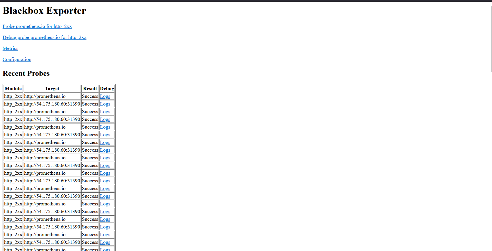

12. **Run Node Exporter**

    ```bash
    cd node_exporter-1.8.0.linux-amd64
    # Run in background
    ./node_exporter &
    ```
13. **Access Node_Exporter**

    Visit `http://runner-ec2-public-ip:9100`
    

14. **Access prometheus**

    Re-run Prometheus

    Visit `http://runner-ec2-public-ip:9090`

     

### Configure Graphana:

1. **Download Graphana**

    Go to `https://grafana.com/grafana/download` and get Graphana linux version.
    
    ```bash
    # Run commands one by one
    sudo apt-get install -y adduser libfontconfig1 musl
    wget https://dl.grafana.com/enterprise/release/grafana-enterprise_10.4.2_amd64.deb
    sudo dpkg -i grafana-enterprise_10.4.2_amd64.deb
    ```
2. **Run Graphana**

    ```bash
    sudo /bin/systemctl/ start graphana-server
    ```
3. **Access Graphana**

    Visit `http://runner-ec2-public-ip:3000`

    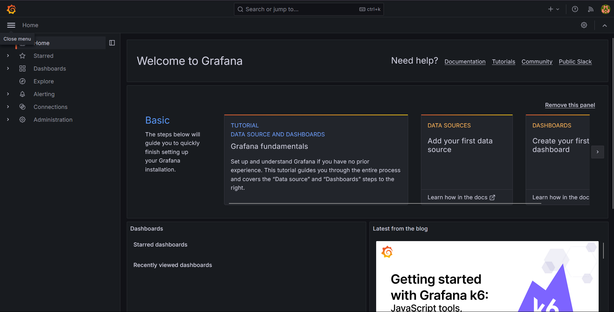 

4. **Add Connection to Prometheus**

    Home -> Connections -> Add new connnection -> Search Prometheus -> Add -> Prometheua Serever URL -> `http://runner-ec2-public-ip:9090` -> Save and Test
    
    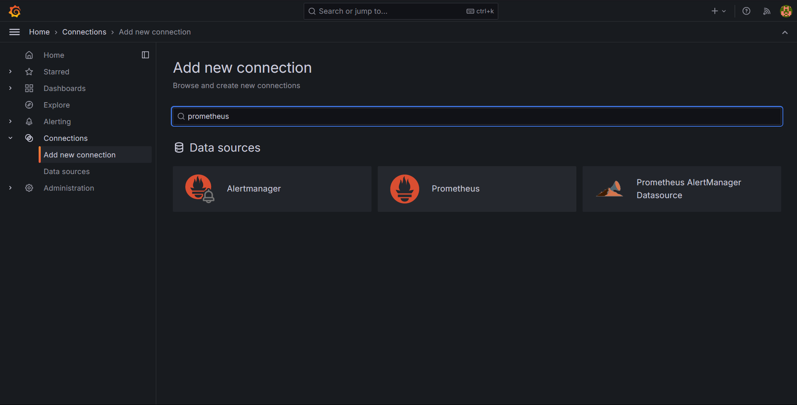

5. **Create Dashboard**
    
    - visit https://grafana.com/grafana/dashboards/7587-prometheus-blackbox-exporter/ and import the dashboard by copying dashboard ID.

    - visit https://grafana.com/grafana/dashboards/1860-node-exporter-full/ and import the dashboard by copying dashboard ID.
    - Refresh dashboard.

    

    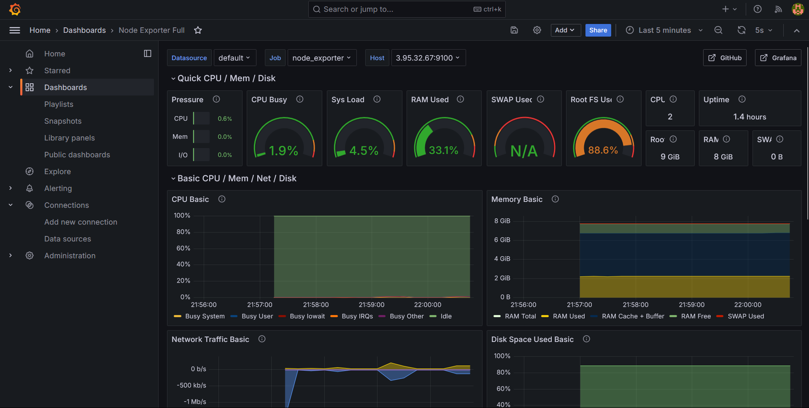


## License

This project is licensed under the MIT License. 

## Contributing

Contributions to the Spring Boot BoardGame application and deployment guide are welcome! If you have any suggestions, bug fixes, or improvements, feel free to open an issue or submit a pull request.

## Acknowledgements

Special thanks to the Spring Boot community, Kubernetes community, GitHub Actions, Prometheus, Grafana, Blackbox, Node Exporter, and Trivy and Aditya Jaisawal for their contributions to the ecosystem.
